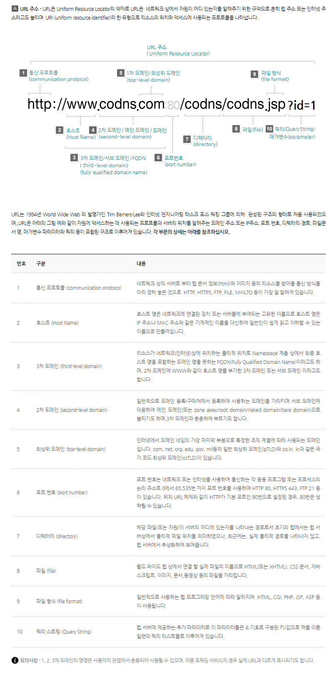

# AboutWeb

유형: 실습문서
주제: 웹개발첫걸음
순번: 1

# 1. 웹서비스란?

🐶 html 은 웹서비스에 근간이 되는 언어

[웹기초.pdf](%EC%9B%B9%EA%B8%B0%EC%B4%88.pdf)

# 2. 도메인이란?

<aside>
📢 숫자로 된 컴퓨터 주소를 사람이 쉽게 기억할수 있게 문자로 변경한것

</aside>

1. 내아이디.dothome.co.kr 은 나의 홈페이지 도메인

출처: 한국인터넷정보센터

# 4. HTML 이란?

[[https://docs.google.com/presentation/d/1wIXjxiZgsOoapLMXi4n1YZth414l4qhj/edit?usp=drive_link&ouid=116406847706195404122&rtpof=true&sd=true](https://docs.google.com/presentation/d/1wIXjxiZgsOoapLMXi4n1YZth414l4qhj/edit?usp=drive_link&ouid=116406847706195404122&rtpof=true&sd=true)](https://docs.google.com/presentation/d/1wIXjxiZgsOoapLMXi4n1YZth414l4qhj/preview?usp=drive_link&ouid=116406847706195404122&rtpof=true&sd=true)